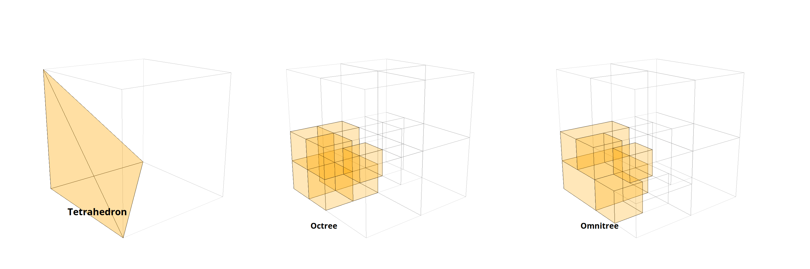
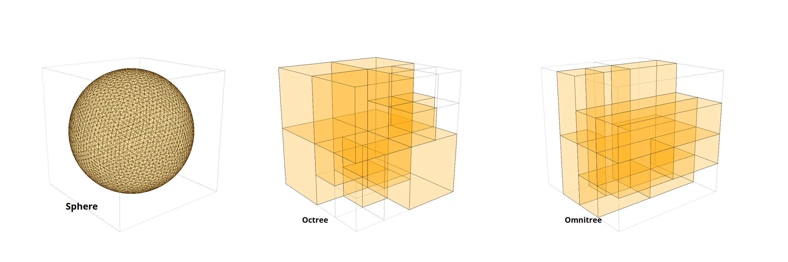
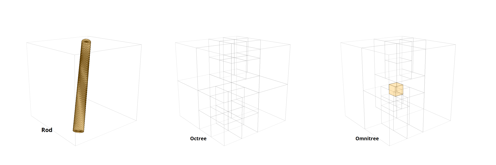
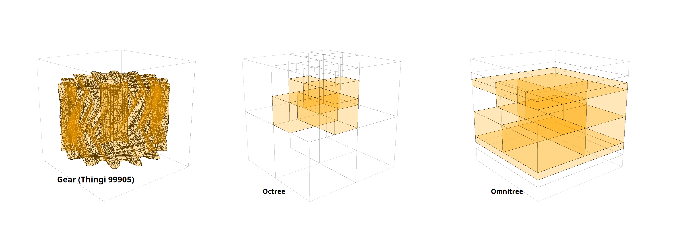
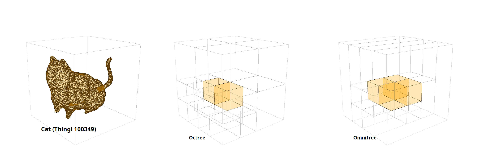
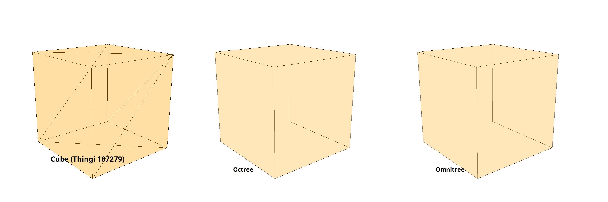

# thingies_with_omnitrees

representing 3d objects as octrees and omnitrees through [dyada](https://github.com/freifrauvonbleifrei/DyAda)

For full instructions on making figures and images, see the [zenodo record](https://zenodo.org/records/15909872). 
You can also find the generated data there.

## Animations of "special" thingies

